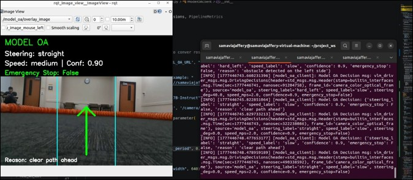
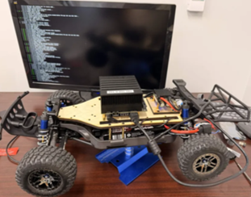

## VLM-Driver: Baseline Perception and Obstacle-Avoidance Pipeline

This branch contains the independently runnable perception, obstacle-avoidance, and offline-testing pipeline that I developed as part of the collaborative VLM-Driver course project.

The overall project investigated whether vision-language models could directly generate driving decisions for a small-scale autonomous vehicle. The VLM-based approach was evaluated against a classical computer-vision baseline operating on images from a forward-facing camera.

This branch focuses specifically on:

A classical vision-based obstacle-avoidance baseline
The ROS 2 perception-to-command software pipeline
VLM inference wrappers and output-safety checks
Offline image and video testing utilities
Debug masks, visual overlays, and behavioral analysis

The complete team project, including hardware interfaces and vehicle-level integration, is available on the main branch.



## Project Context

VLM-Driver was developed collaboratively as a course project at the University of Central Florida. The complete platform included a small-scale F1-tenth style autonomous vehicle, a forward-facing Intel RealSense camera, ROS 2, a VESC-based drive interface, classical obstacle avoidance, and VLM-based driving control.



This branch preserves my individual software contribution and can be used to inspect and test the perception and decision pipeline without operating the physical vehicle.

## My Contributions

I was responsible for:

Developing the ROS 2 autonomy software pipeline connecting camera input, obstacle-avoidance decisions, and the vehicle command mapper.
Implementing and tuning the classical computer-vision obstacle-avoidance baseline.
Using HSV segmentation, morphological filtering, and region-based occupancy scores to determine steering and speed decisions.
Developing a monocular proximity heuristic based on image occupancy to trigger slow, creep, and emergency-stop behavior.
Implementing model-inference wrappers and safety validation for structured VLM outputs.
Creating offline testing utilities, including fake camera publishers, video-to-image processing, and image-request scripts.
Adding masks, visual overlays, debugging outputs, and performance-monitoring interfaces.
Analyzing VLM latency, repeated-command bias, unsafe directional decisions, and output-format inconsistencies.

My original implementation is preserved in the
`samavia/baseline_OA` branch. This branch contains a version that can
be tested without the physical vehicle.

## Packages

### `vlm_driver_msgs`

This package defines the custom messages shared by the other nodes.

- `DrivingDecisions.msg`
  - `source`: where the decision came from, such as `baseline` or `model_oa`
  - `steering_label`: human-readable steering choice
  - `speed_label`: human-readable speed choice
  - `steering_deg`: numeric steering angle in degrees
  - `speed_mps`: numeric speed in meters per second
  - `confidence`: confidence score from the decision node
  - `emergency_stop`: true when the vehicle should stop immediately

- `PipelineMetrics.msg`
  - Unused

### `baseline_cv`

This package contains the classical computer vision pipeline.

- `baseline_node`
  - subscribes to `/camera/camera/color/image_raw`
  - detects orange obstacle regions in the image
  - splits the image into left, center, and right sectors
  - publishes a `DrivingDecisions` message on `/baseline/decision`
  - publishes debug images on `/baseline/debug/overlay` and `/baseline/debug/mask`
  - publishes timing metrics on `/baseline/metrics`

- `fake_camera_pub`
  - publishes simple synthetic test frames to `/camera/camera/color/image_raw`
  - useful when there is no real camera connected

- `video_to_image`
  - reads a video file with OpenCV
  - publishes each frame as a ROS `sensor_msgs/Image`
  - useful for replaying saved test footage

### `model_oa`

This package contains the model-based driving pipeline.

- `model_oa_client`
  - subscribes to `/camera/camera/color/image_raw`
  - sends throttled camera frames to a remote OpenAI-compatible VLM endpoint
  - expects JSON with steering, speed, confidence, emergency stop, and reason
  - publishes a `DrivingDecisions` message on `/model_oa/decision`
  - publishes an overlay image on `/model_oa/overlay_image`

- `remote_model_oa/model.py`
  - Modal deployment file for serving `Qwen/Qwen2.5-VL-7B-Instruct` through SGLang
  - this is what creates the remote endpoint used by `model_oa_client`

- `remote_model_oa/test_request.py`
  - small text-only smoke test for the remote model endpoint

- `remote_model_oa/test_image_request.py`
  - small image smoke test for the remote model endpoint

### `command_mapper`

This package converts high-level driving decisions into an Ackermann command.

- `mapper_node`
  - subscribes to `/baseline/decision`
  - subscribes to `/model_oa/decision`
  - maps steering labels to steering angles
  - maps speed labels to meters per second
  - forces speed to `0.0` if `emergency_stop` is true
  - publishes `ackermann_msgs/AckermannDriveStamped` on `/drive`

## How The Modules Work Together

The camera source publishes images:

```text
/camera/camera/color/image_raw
```

The image can come from a real camera, the fake camera publisher, or a video file.

The baseline pipeline reads the image and publishes:

```text
/baseline/decision
```

The model pipeline reads the same image and publishes:

```text
/model_oa/decision
```

The command mapper listens for decision messages and publishes the final vehicle command:

```text
/drive
```

Basic flow:

```text
camera / fake camera / video
        |
        v
/camera/camera/color/image_raw
        |
        +--> baseline_cv baseline_node --> /baseline/decision
        |
        +--> model_oa model_oa_client --> /model_oa/decision

/baseline/decision or /model_oa/decision
        |
        v
command_mapper mapper_node
        |
        v
/drive
```

## Build The Workspace

Run these from the workspace root:

```bash
cd ~/project_ws
source /opt/ros/$ROS_DISTRO/setup.bash
rosdep install --from-paths src --ignore-src -r -y
colcon build
source install/setup.bash
```

If `$ROS_DISTRO` is not set, replace it with your ROS 2 distro name, for example:

```bash
source /opt/ros/humble/setup.bash
```

After every new terminal, source the workspace again:

```bash
cd ~/project_ws
source install/setup.bash
```

## Run With The Fake Camera And Baseline CV

Terminal 1:

```bash
cd ~/project_ws
source install/setup.bash
ros2 run baseline_cv fake_camera_pub
```

Terminal 2:

```bash
cd ~/project_ws
source install/setup.bash
ros2 run baseline_cv baseline_node
```

Terminal 3:

```bash
cd ~/project_ws
source install/setup.bash
ros2 run command_mapper mapper_node
```

Useful topics to watch:

```bash
ros2 topic echo /baseline/decision
ros2 topic echo /drive
ros2 topic echo /baseline/metrics
```

Useful debug images:

```bash
ros2 topic list
ros2 run rqt_image_view rqt_image_view
```

In `rqt_image_view`, choose `/baseline/debug/overlay` or `/baseline/debug/mask`.

## Run With A Video File

Terminal 1:

```bash
cd ~/project_ws
source install/setup.bash
ros2 run baseline_cv video_to_image --ros-args -p video_path:=/path/to/video.mp4
```

Terminal 2:

```bash
cd ~/project_ws
source install/setup.bash
ros2 run baseline_cv baseline_node
```

Terminal 3:

```bash
cd ~/project_ws
source install/setup.bash
ros2 run command_mapper mapper_node
```

Optional video parameters:

```bash
ros2 run baseline_cv video_to_image --ros-args \
  -p video_path:=/path/to/video.mp4 \
  -p image_topic:=/camera/camera/color/image_raw \
  -p frame_id:=camera_color_optical_frame \
  -p loop:=true
```

## Run With A Real Camera

Start your camera driver so it publishes:

```text
/camera/camera/color/image_raw
```

Then run the baseline node and mapper:

```bash
cd ~/project_ws
source install/setup.bash
ros2 run baseline_cv baseline_node
```

In another terminal:

```bash
cd ~/project_ws
source install/setup.bash
ros2 run command_mapper mapper_node
```

If your camera publishes to a different topic, pass the image topic parameter:

```bash
ros2 run baseline_cv baseline_node --ros-args -p image_topic:=/your/camera/topic
```

## Run The Model OA Pipeline

First deploy or start the remote model endpoint.

If the Modal CLI is not set up yet:

```bash
python3 -m pip install modal
modal setup
```

From the remote model folder:

```bash
cd ~/project_ws/src/model_oa/model_oa/remote_model_oa
modal deploy model.py
```

When Modal prints the endpoint URL, export it before starting the ROS node:

```bash
export MODEL_OA_URL="https://your-modal-endpoint/v1/chat/completions"
```

Then run an image source, the model client, and the command mapper.

Terminal 1, for example with the fake camera:

```bash
cd ~/project_ws
source install/setup.bash
ros2 run baseline_cv fake_camera_pub
```

Terminal 2:

```bash
cd ~/project_ws
source install/setup.bash
export MODEL_OA_URL="https://your-modal-endpoint/v1/chat/completions"
ros2 run model_oa model_oa_client
```

Terminal 3:

```bash
cd ~/project_ws
source install/setup.bash
ros2 run command_mapper mapper_node
```

Useful topics to watch:

```bash
ros2 topic echo /model_oa/decision
ros2 topic echo /drive
```

Model overlay image:

```bash
ros2 run rqt_image_view rqt_image_view
```

Then choose:

```text
/model_oa/overlay_image
```

To stop the deployed Modal app:

```bash
modal app stop example-sglang-low-latency
```

## Quick Remote Model Tests

These scripts are for checking that the remote model endpoint responds before using it in ROS.
They use the endpoint URL written inside each script.

```bash
cd ~/project_ws/src/model_oa/model_oa/remote_model_oa
python3 test_request.py
python3 test_image_request.py
```

## Common Parameters

Baseline CV:

```bash
ros2 run baseline_cv baseline_node --ros-args \
  -p image_topic:=/camera/camera/color/image_raw \
  -p roi_top_ratio:=0.0 \
  -p stop_score_threshold:=0.08 \
  -p near_stop_score_threshold:=0.20 \
  -p blocked_score_threshold:=0.05
```

Model OA client:

```bash
ros2 run model_oa model_oa_client --ros-args \
  -p image_topic:=/camera/camera/color/image_raw \
  -p decision_topic:=/model_oa/decision \
  -p request_period:=0.5 \
  -p resize_width:=640 \
  -p jpeg_quality:=70
```

Command mapper:

```bash
ros2 run command_mapper mapper_node --ros-args \
  -p decision_topic1:=/baseline/decision \
  -p decision_topic2:=/model_oa/decision \
  -p command_topic:=/drive
```

## Topic Summary

| Topic | Type | Published By | Used By |
| --- | --- | --- | --- |
| `/camera/camera/color/image_raw` | `sensor_msgs/Image` | camera, `fake_camera_pub`, or `video_to_image` | `baseline_node`, `model_oa_client` |
| `/baseline/decision` | `vlm_driver_msgs/DrivingDecisions` | `baseline_node` | `mapper_node` |
| `/model_oa/decision` | `vlm_driver_msgs/DrivingDecisions` | `model_oa_client` | `mapper_node` |
| `/drive` | `ackermann_msgs/AckermannDriveStamped` | `mapper_node` | vehicle controller |
| `/baseline/debug/overlay` | `sensor_msgs/Image` | `baseline_node` | debug viewing |
| `/baseline/debug/mask` | `sensor_msgs/Image` | `baseline_node` | debug viewing |
| `/baseline/metrics` | `vlm_driver_msgs/PipelineMetrics` | `baseline_node` | performance checking |
| `/model_oa/overlay_image` | `sensor_msgs/Image` | `model_oa_client` | debug viewing |

## Notes

- Always build and source the workspace after changing message definitions.
- Use only one command source at a time if your vehicle controller does not handle multiple decision streams safely.
- The baseline node is local and fast. The model node depends on network latency and the remote Modal endpoint.
- If `ros2 run` cannot find a package or executable, rebuild with `colcon build` and source `install/setup.bash` again.
